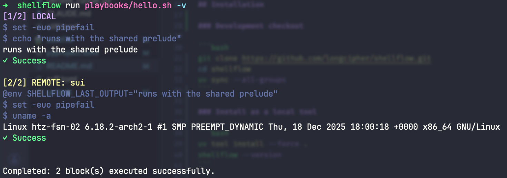

# ShellFlow

> AI agent native DevOps bash script orchestrator.

[](https://deepwiki.com/longcipher/shellflow)
[](https://context7.com/longcipher/shellflow)
[](https://www.python.org/downloads/)
[](LICENSE)
[](https://pypi.org/project/shellflow/)


ShellFlow is a minimal shell script orchestrator for mixed local and remote execution. You write one shell script, mark execution boundaries with comments, and ShellFlow runs each block in order while resolving remote targets from your SSH configuration.



## What It Does

- Split a shell script into `@LOCAL` and `@REMOTE` execution blocks.
- Run each block fail-fast, in order.
- Reuse the shared prelude before the first marker for every block.
- Pass the previous block output forward as `SHELLFLOW_LAST_OUTPUT`.
- Export named scalar values from a block into later block environments.
- Emit either a final JSON report or streaming JSON Lines events for agents.
- Support bounded `@TIMEOUT` and `@RETRY` directives without embedding workflow logic.
- Provide non-interactive, dry-run, and audit-log modes for automated execution.
- Resolve remote targets from `~/.ssh/config` or a custom SSH config path.

## Quick Start

```bash
uv tool install shellflow

shellflow run playbooks/hello.sh
```

## Installation

### User installation (from PyPI)

```bash
uv tool install shellflow
shellflow --version
```

### Install Skill

```bash
npx skills add longcipher/shellflow
```

This installs the agent skill from this repository for writing and reviewing Shellflow playbooks.

To upgrade to the latest version:

```bash
uv tool upgrade shellflow
```

### Development checkout

```bash
git clone https://github.com/longcipher/shellflow.git
cd shellflow
uv sync --all-groups # uv sync --refresh --reinstall --no-cache
```

### Install as a local tool (from source)

```bash
uv tool install --force .
shellflow --version
```

### Install into the active environment (from source)

```bash
uv pip install -e .
shellflow --version
```

## Script Format

Shellflow recognizes two markers:

- `# @LOCAL`
- `# @REMOTE <ssh-host>`

Shellflow also recognizes bounded block directives at the top of a block body:

- `# @TIMEOUT <seconds>`
- `# @RETRY <count>`
- `# @EXPORT NAME=stdout|stderr|output|exit_code`
- `# @SHELL <shell>` - Specify the shell to use (e.g., `zsh`, `bash`)

`<ssh-host>` must match a `Host` entry in your SSH config. Shellflow then connects using that SSH host definition, which means the actual machine can be resolved through the configured `HostName`, `User`, `Port`, and `IdentityFile` values.

Example:

```bash
#!/bin/bash
set -euo pipefail

# @LOCAL
# @EXPORT VERSION=stdout
echo "runs locally"

# @REMOTE sui
uname -a

# @LOCAL
echo "remote output: $SHELLFLOW_LAST_OUTPUT"
echo "version = $VERSION"
```

Using `@SHELL` for remote servers with non-bash default shells:

Shellflow starts remote shells in login mode. For remote `zsh` and `bash` blocks, Shellflow also bootstraps `~/.zshrc` or `~/.bashrc` quietly before running your commands so tools initialized there, such as `mise`, remain available in non-interactive automation even if the rc file exits non-zero.

```bash
#!/bin/bash

# @REMOTE zsh-server
# @SHELL zsh
# zsh-specific commands work here
reload
compdef

# @REMOTE bash-server
# Default bash shell is used
ls -la
```

## SSH Configuration

Example `~/.ssh/config` entry:

```sshconfig
Host sui
    HostName 192.168.1.100
    User deploy
    Port 22
    IdentityFile ~/.ssh/id_ed25519
```

With that config, this block is valid:

```bash
# @REMOTE sui
hostname
```

This is intentional:

- Shellflow accepts configured SSH host names, not arbitrary free-form targets.
- Unknown remote targets fail early with a clear error before spawning `ssh`.
- You can override the default config path with `--ssh-config`.

## Execution Model

Each block runs in a fresh shell.

- Shell options from the prelude are copied into every block.
- Shell state like `cd`, shell variables, aliases, and `export` commands does not persist across blocks.
- Explicit context values are passed forward through environment variables.

Example:

```bash
# @LOCAL
echo "build-123"

# @LOCAL
echo "last output = $SHELLFLOW_LAST_OUTPUT"
```

Named exports are additive to `SHELLFLOW_LAST_OUTPUT`:

```bash
# @LOCAL
# @EXPORT VERSION=stdout
echo "2026.03.15"

# @REMOTE sui
echo "deploying $VERSION"
echo "last output = $SHELLFLOW_LAST_OUTPUT"
```

Lines before the first marker are treated as a shared prelude and prepended to every executable block:

```bash
#!/bin/bash
set -euo pipefail

# @LOCAL
echo "prelude is active"

# @REMOTE sui
echo "prelude is also active here"
```

## Agent-Native Usage

Shellflow is designed to be the execution substrate for an outer agent, not an embedded planner.

- Use `--json` when you want one final machine-readable run report.
- Use `--jsonl` when you want ordered event records while the script runs.
- Use `--no-input` for CI or agent runs where interactive prompts must fail deterministically.
- Use `--dry-run` to preview planned execution without running commands.
- Use `--audit-log <path>` to mirror the structured event stream into a redacted JSONL file.

Recommended agent flow:

1. Generate or select a plain shell script with `@LOCAL` and `@REMOTE` markers.
2. Add bounded directives only where needed: `@TIMEOUT`, `@RETRY`, and `@EXPORT`.
3. Run with `--json` or `--jsonl`.
4. Let the outer agent decide whether to retry, branch, or stop based on Shellflow's structured result.

Shellflow intentionally does not provide:

- Conditional directives such as `@IF stdout_contains=...`
- A workflow DSL or embedded ReAct loop
- Heuristic destructive-command detection

Those decisions belong in the outer agent or automation layer.

### Agent-Native Logging Optimizations

Shellflow includes several logging optimizations specifically designed for LLM agent consumption:

- **ANSI Escape Sequence Stripping**: Automatically removes color codes, cursor movements, and other terminal control sequences that would consume unnecessary tokens in LLM context windows.

- **Command-Level Granularity**: Uses `set -x` with custom `PS4` prompts to provide per-command execution traces, allowing agents to pinpoint exactly which command failed in a multi-command block.

- **Stream Debouncing**: Implements intelligent buffering for progress bars and streaming output, preventing token waste from rapid `\r` updates while ensuring important output isn't lost.

- **Semantic Pipeline**: Transforms raw terminal output into structured, agent-friendly data with clean text and preserved timing information.

These optimizations ensure that when agents process Shellflow's JSONL output, they receive clean, actionable data without the visual formatting artifacts that make terminal output human-friendly but LLM-confusing.

## CLI

```text
shellflow run <script>
shellflow run <script> --verbose
shellflow run <script> --json
shellflow run <script> --jsonl
shellflow run <script> --no-input
shellflow run <script> --dry-run
shellflow run <script> --audit-log ./audit.jsonl --jsonl
shellflow run <script> --ssh-config ./ssh_config
shellflow --version
```

Examples:

```bash
shellflow run playbooks/hello.sh
shellflow run playbooks/hello.sh -v
shellflow run playbooks/hello.sh --json
shellflow run playbooks/hello.sh --jsonl --no-input
shellflow run playbooks/hello.sh --dry-run --jsonl
shellflow run playbooks/hello.sh --audit-log ./audit.jsonl --jsonl
shellflow run playbooks/hello.sh --ssh-config ~/.ssh/config.work
```

## Development

Useful commands:

```bash
just sync
just test
just bdd
just test-all
just typecheck
just build
just publish
```

Direct verification commands:

```bash
uv run pytest -q
uv run behave features
uv run ruff check .
uv run ty check src tests
uv build
```

## Release Process

Shellflow supports both local publishing and GitHub Actions release publishing.

### Local publish

```bash
just publish
```

`uv publish` uses standard `uv` authentication mechanisms such as `UV_PUBLISH_TOKEN`, or PyPI trusted publishing when supported by the environment.

### GitHub Actions publish on tag push

The repository includes:

- `.github/workflows/ci.yml` for lint, type-check, test, and build verification.
- `.github/workflows/release.yml` for publishing to PyPI when a tag like `v0.1.0` is pushed.

Recommended release flow:

```bash
git tag v0.1.0
git push origin v0.1.0
```

To use trusted publishing with PyPI:

1. Create a `pypi` environment in GitHub repository settings.
2. Add this repository as a trusted publisher in the PyPI project settings.
3. Push a `v*` tag.

The release workflow then runs verification, builds distributions with `uv build`, and uploads them with `uv publish`.

## Project Layout

```text
shellflow/
├── src/shellflow.py
├── tests/
├── features/
├── playbooks/
├── pyproject.toml
├── Justfile
└── README.md
```

## License

Apache-2.0
