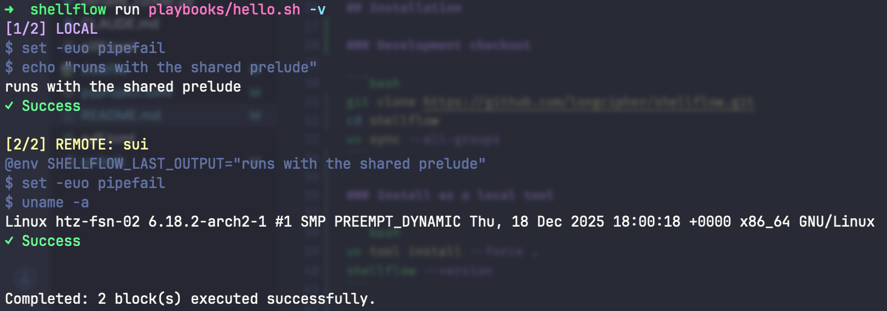

# ShellFlow

> AI agent native DevOps bash script orchestrator.

[](https://deepwiki.com/longcipher/shellflow)
[](https://context7.com/longcipher/shellflow)
[](https://www.python.org/downloads/)
[](LICENSE)
[](https://pypi.org/project/shellflow/)


ShellFlow is a minimal shell script orchestrator for mixed local and remote execution. You write one shell script, mark execution boundaries with comments, and ShellFlow runs each block in order while resolving remote targets from your SSH configuration.



## What It Does

- Split a shell script into `@LOCAL` and `@REMOTE` execution blocks.
- Run blocks sequentially by default, or run annotated groups with `--mode parallel`.
- Freeze uppercase prelude assignments once so values such as `BUILD_ID=$(date +%s)` stay consistent across local and remote blocks.
- Declare script parameters with `# @option` and pass them as CLI flags or agent schema values.
- Run focused parts of a playbook with `# @TASK` and `shellflow run --task`.
- Reuse command snippets with `# @MACRO` and `# @HELPER`.
- Add local lifecycle hooks for setup, cleanup, success, and failure handling.
- Pass the previous block output forward as `SHELLFLOW_LAST_OUTPUT`.
- Export named scalar values from a block into later block environments.
- Emit either a final JSON report or streaming JSON Lines events for agents.
- Support bounded `@TIMEOUT` and `@RETRY` directives without embedding workflow logic.
- Provide non-interactive, dry-run, audit-log, doctor, and agent-run modes for automated execution.
- Resolve remote targets from inline `@SERVER` definitions, `~/.ssh/config`, or a custom SSH config path.

## Quick Start

```bash
uv tool install shellflow

shellflow run playbooks/hello.sh
```

## Installation

### User installation (from PyPI)

```bash
uv tool install shellflow
shellflow --version
```

### Install Skill

```bash
npx skills add longcipher/shellflow
```

This installs the agent skill from this repository for writing and reviewing Shellflow playbooks.

To upgrade to the latest version:

```bash
uv tool upgrade shellflow
```

### Development checkout

```bash
git clone https://github.com/longcipher/shellflow.git
cd shellflow
uv sync --all-groups # uv sync --refresh --reinstall --no-cache
```

### Install as a local tool (from source)

```bash
uv tool install --force .
shellflow --version
```

### Install into the active environment (from source)

```bash
uv pip install -e .
shellflow --version
```

## Playbook Format

Shellflow playbooks are ordinary shell scripts plus comment markers. Marker names are shown uppercase here and should be written that way for readability; the parser accepts marker names case-insensitively.

### Block markers

- `# @LOCAL`
- `# @REMOTE <ssh-host>`

`<ssh-host>` must match an inline `@SERVER` definition or a `Host` entry in your SSH config. Shellflow then connects using the configured `host`, `HostName`, `User`, `Port`, and identity key values.

### Block directives

Block directives must appear immediately after the `# @LOCAL` or `# @REMOTE <ssh-host>` marker, before the first command in that block.

- `# @TIMEOUT <seconds>`
- `# @RETRY <count>`
- `# @EXPORT NAME=stdout|stderr|output|exit_code`
- `# @SHELL <shell>` - specify `bash`, `zsh`, or `sh`.
- `# @PARALLEL [group]` - mark this block for grouped parallel execution.

`@PARALLEL` may appear immediately before a block marker or as a block directive. It applies only to that one block. Consecutive parallel blocks are grouped together when you run with `--mode parallel`.

Example:

```bash
#!/bin/bash
set -euo pipefail

# @option release-name=
# @option branch=main

# @LOCAL
# @EXPORT VERSION=stdout
echo "$RELEASE_NAME-$BRANCH"

# @REMOTE sui
uname -a

# @LOCAL
echo "remote output: $SHELLFLOW_LAST_OUTPUT"
echo "version = $VERSION"
```

### Dynamic options

Declare script parameters near the top of the file:

```bash
# @option staging
# @option branch=main
# @option release-name=
```

- `# @option staging` is boolean. Passing `--staging` sets `STAGING=1`.
- `# @option branch=main` has a default. Passing `--branch develop` sets `BRANCH=develop`.
- `# @option release-name=` is required. Pass `--release-name v1` or set `RELEASE_NAME` in the environment.
- Option names become uppercase environment variables with dashes converted to underscores.

Run it:

```bash
shellflow run deploy.sh --branch develop --release-name v2026.05.01 --staging
```

### Preamble freeze

Lines before the first block marker are the shared prelude. Uppercase assignments in the prelude are evaluated once locally and then exported into every block with a frozen value:

```bash
BUILD_ID=$(date +%s)

# @LOCAL
echo "$BUILD_ID"

# @REMOTE sui
echo "$BUILD_ID"
```

Both blocks receive the same `BUILD_ID`. Non-assignment prelude lines, such as `set -euo pipefail` and helper functions, are still prepended to each block.

Keep the prelude declarative. Avoid one-time side effects such as `cd`, `rm`, or deployment commands before the first marker.

### Tasks and macros

Use `# @TASK <name>` to label blocks and `--task` to run only that task:

```bash
# @TASK build
# @LOCAL
echo "build"

# @TASK deploy
# @REMOTE sui
echo "deploy"
```

```bash
shellflow run deploy.sh --task build
```

Use a single-line macro to define a task flow:

```bash
# @MACRO release build deploy smoke-test

# @TASK build
# @LOCAL
echo "build"

# @TASK deploy
# @REMOTE sui
echo "deploy"

# @TASK smoke-test
# @LOCAL
echo "smoke"
```

```bash
shellflow run deploy.sh --task release
```

Macros can also expand command snippets inside a block:

```bash
# @MACRO print_env
#   env | sort
# @ENDMACRO

# @LOCAL
print_env
```

### Helpers

Helpers are reusable command snippets. They are expanded when a block contains only the helper name on a line:

```bash
# @HELPER backup_db
#   pg_dump "$DATABASE_URL" > backup.sql
# @ENDHELPER

# @LOCAL
backup_db
```

### Lifecycle hooks

Hooks run locally and share Shellflow's execution context:

- `PRE` - once before all main blocks.
- `BEFORE` - before each main block.
- `AFTER` - after each main block.
- `SUCCESS` - after all main blocks succeed.
- `ERROR` - after a hook or main block fails.
- `FINISHED` - at the end, whether the run succeeds or fails.

`POST` is accepted as an alias for `AFTER`; `FINALLY` is accepted as an alias for `FINISHED`.

```bash
# @HOOK PRE
#   echo "prepare"
# @ENDHOOK

# @HOOK ERROR
#   echo "rollback or collect diagnostics"
# @ENDHOOK

# @HOOK FINISHED
#   echo "cleanup"
# @ENDHOOK
```

### Parallel groups

Mark each block that should join the parallel group:

```bash
# @PARALLEL web
# @REMOTE web-1
systemctl restart nginx

# @PARALLEL web
# @REMOTE web-2
systemctl restart nginx

# @LOCAL
echo "runs after the parallel group"
```

Run with:

```bash
shellflow run restart.sh --mode parallel
```

Without `--mode parallel`, blocks run sequentially even if annotated.

### Remote shells and tracing

Using `@SHELL` for remote servers with non-bash default shells:

Shellflow starts remote shells in login mode. For remote `zsh` and `bash` blocks, Shellflow also bootstraps `~/.zshrc` or `~/.bashrc` quietly before running your commands so tools initialized there, such as `mise`, remain available in non-interactive automation even if the rc file exits non-zero.

```bash
#!/bin/bash

# @REMOTE zsh-server
# @SHELL zsh
# zsh-specific commands work here
reload
compdef

# @REMOTE bash-server
# Default bash shell is used
ls -la
```

Remote verbose tracing uses the shell's `DEBUG` trap and executes the block as one native script. That preserves multi-line Bash and zsh constructs such as `if/else/fi`, `for` loops, and function definitions.

## SSH Configuration

You can define remote hosts inline:

```bash
# @SERVER sui
#   host: 192.168.1.100
#   user: deploy
#   port: 22
#   key: ~/.ssh/id_ed25519

# @REMOTE sui
hostname
```

Inline server definitions are useful for portable playbooks. The `host` field is required; `user`, `port`, and `key` are optional.

Example `~/.ssh/config` entry:

```sshconfig
Host sui
    HostName 192.168.1.100
    User deploy
    Port 22
    IdentityFile ~/.ssh/id_ed25519
```

With that config, this block is valid:

```bash
# @REMOTE sui
hostname
```

This is intentional:

- Shellflow accepts configured SSH host aliases, not arbitrary comma-separated or free-form targets.
- Unknown remote targets fail early with a clear error before spawning `ssh`.
- You can override the default config path with `--ssh-config`.

## Execution Model

Each block runs in a fresh shell.

- Shell options from the prelude are copied into every block.
- Shell state like `cd`, shell variables, aliases, and `export` commands does not persist across blocks.
- Explicit context values are passed forward through environment variables.

Example:

```bash
# @LOCAL
echo "build-123"

# @LOCAL
echo "last output = $SHELLFLOW_LAST_OUTPUT"
```

Named exports are additive to `SHELLFLOW_LAST_OUTPUT`:

```bash
# @LOCAL
# @EXPORT VERSION=stdout
echo "2026.03.15"

# @REMOTE sui
echo "deploying $VERSION"
echo "last output = $SHELLFLOW_LAST_OUTPUT"
```

Lines before the first marker are treated as a shared prelude and prepended to every executable block:

```bash
#!/bin/bash
set -euo pipefail

# @LOCAL
echo "prelude is active"

# @REMOTE sui
echo "prelude is also active here"
```

Uppercase assignments in the prelude are special: Shellflow evaluates them once locally, freezes the values, and exports them into every block. That keeps release IDs, timestamps, and option-derived values stable across local and remote execution.

## Agent-Native Usage

Shellflow is designed to be the execution substrate for an outer agent, not an embedded planner.

- Use `--json` when you want one final machine-readable run report.
- Use `--jsonl` when you want ordered event records while the script runs.
- Use `--no-input` for CI or agent runs where interactive prompts must fail deterministically.
- Use `--dry-run` to preview planned execution without running commands.
- Use `--audit-log <path>` to mirror the structured event stream into a redacted JSONL file.
- Use `agent-run --json-input` when an agent already has the script body and option values in memory.

Recommended agent flow:

1. Generate or select a plain shell script with `@LOCAL` and `@REMOTE` markers.
2. Read `# @option` declarations and provide required values.
3. Add bounded directives only where needed: `@TIMEOUT`, `@RETRY`, and `@EXPORT`.
4. Run with `--json` or `--jsonl`.
5. Let the outer agent decide whether to retry, branch, or stop based on Shellflow's structured result.

Agent-run input:

```bash
shellflow agent-run --json-input '{
  "script": "# @option release-name=\n# @LOCAL\necho \"$RELEASE_NAME\"\n",
  "options": {"release-name": "v2026.05.01"},
  "dry_run": false
}'
```

Shellflow intentionally does not provide:

- Conditional directives such as `@IF stdout_contains=...`
- A workflow DSL or embedded ReAct loop
- Heuristic destructive-command detection
- Multi-host comma expansion inside one `@REMOTE` marker

Those decisions belong in the outer agent or automation layer.

### Agent-Native Reporting

Shellflow's structured modes are designed for LLM agent consumption:

- **Stable run and block identifiers**: JSON and JSONL output include `run_id`, one-based block indexes, and stable `block-N` identifiers.

- **Separated stdout and stderr**: Block reports keep stdout, stderr, combined output, exit code, failure kind, retries, timeouts, and exported values explicit.

- **Command-level remote tracing**: Remote verbose execution uses shell `DEBUG` traps to report the command about to run without breaking multi-line shell syntax.

- **Audit-safe exports**: Audit logs redact exported values whose names look secret-like, such as `TOKEN`, `SECRET`, or `PASSWORD`.

- **Bounded verbose output**: `--output-lines` limits verbose per-command log tails while preserving full block output in structured results.

## CLI

```text
shellflow run <script>
shellflow run <script> --verbose
shellflow run <script> --output-lines 50
shellflow run <script> --json
shellflow run <script> --jsonl
shellflow run <script> --no-input
shellflow run <script> --dry-run
shellflow run <script> --mode parallel
shellflow run <script> --task <task-or-macro>
shellflow run <script> --audit-log ./audit.jsonl --jsonl
shellflow run <script> --ssh-config ./ssh_config
shellflow run <script> --release-name v1 --branch main
shellflow agent-run --json-input '{"script":"# @LOCAL\necho hi\n"}'
shellflow doctor [script]
shellflow --version
```

Examples:

```bash
shellflow run playbooks/hello.sh
shellflow run playbooks/hello.sh -v
shellflow run playbooks/hello.sh --json
shellflow run playbooks/hello.sh --jsonl --no-input
shellflow run playbooks/hello.sh --dry-run --jsonl
shellflow run playbooks/hello.sh --audit-log ./audit.jsonl --jsonl
shellflow run playbooks/hello.sh --ssh-config ~/.ssh/config.work
shellflow run playbooks/deploy.sh --task release --mode parallel --json
shellflow doctor playbooks/deploy.sh --ssh-config ~/.ssh/config.work
```

Run `shellflow run --help`, `shellflow agent-run --help`, or `shellflow doctor --help` for the exact command options supported by the installed version.

## Development

Useful commands:

```bash
just sync
just test
just bdd
just test-all
just typecheck
just build
just publish
```

Direct verification commands:

```bash
uv run pytest -q
uv run behave features
uv run ruff check .
uv run ty check src tests
uv build
```

## Release Process

Shellflow supports both local publishing and GitHub Actions release publishing.

### Local publish

```bash
just publish
```

`uv publish` uses standard `uv` authentication mechanisms such as `UV_PUBLISH_TOKEN`, or PyPI trusted publishing when supported by the environment.

### GitHub Actions publish on tag push

The repository includes:

- `.github/workflows/ci.yml` for lint, type-check, test, and build verification.
- `.github/workflows/release.yml` for publishing to PyPI when a tag like `v0.1.0` is pushed.

Recommended release flow:

```bash
git tag v0.1.0
git push origin v0.1.0
```

To use trusted publishing with PyPI:

1. Create a `pypi` environment in GitHub repository settings.
2. Add this repository as a trusted publisher in the PyPI project settings.
3. Push a `v*` tag.

The release workflow then runs verification, builds distributions with `uv build`, and uploads them with `uv publish`.

## Project Layout

```text
shellflow/
├── src/shellflow.py
├── src/advanced_modes.py
├── src/config.py
├── src/doctor.py
├── src/helpers.py
├── src/hooks.py
├── src/macros.py
├── src/variables.py
├── tests/
├── features/
├── playbooks/
├── pyproject.toml
├── Justfile
└── README.md
```

## License

Apache-2.0
