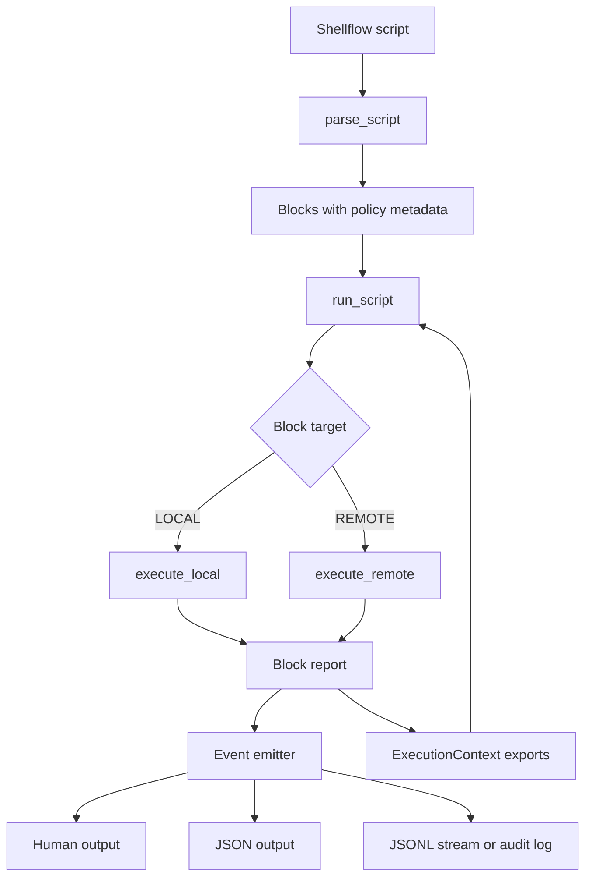

# Design: Agent Native Runner

| Metadata | Details |
| :--- | :--- |
| **Status** | Draft |
| **Created** | 2026-03-15 |
| **Scope** | Full |

## 1. Executive Summary

Shellflow already provides the core of an agent-friendly action primitive: deterministic parsing, sequential execution, SSH reuse, fail-fast behavior, and a simple shell-native authoring model in [src/shellflow.py](/Users/akagi201/src/github.com/longcipher/shellflow/src/shellflow.py). The main gap is not "agent reasoning" inside Shellflow; it is the lack of a stable machine-readable execution contract, bounded non-interactive behavior, and scoped resilience controls that an outer AI agent can rely on.

This design upgrades Shellflow into an AI-agent-native DevOps runner by adding structured output, explicit exit-code semantics, non-interactive execution, block-scoped timeout/retry/export directives, and audit-oriented dry-run/logging. It explicitly rejects turning Shellflow into an embedded workflow engine or ReAct interpreter; the agent stays outside, Shellflow remains a deterministic execution substrate.

## 2. Requirements & Goals

### 2.1 Requirements Coverage Checklist

#### Functional requirements

- Provide structured execution output that an AI agent can parse reliably.
- Support both final JSON report output and streaming event output for real-time observation.
- Provide non-interactive execution mode that avoids hanging on stdin prompts.
- Define stable exit codes that distinguish parse, execution, SSH configuration, and timeout failures.
- Add limited resilience primitives for transient operational failures: timeout and retry.
- Expand context passing beyond `SHELLFLOW_LAST_OUTPUT` with named exports derived from a block result.
- Add preview and audit capabilities suitable for automated DevOps usage.

#### Constraints

- Preserve the current Python CLI shape and the project's lightweight feel.
- Preserve sequential block execution, fail-fast defaults, and SSH-config reuse from [src/shellflow.py](/Users/akagi201/src/github.com/longcipher/shellflow/src/shellflow.py).
- Reuse the existing test stack and BDD harness documented in [pyproject.toml](/Users/akagi201/src/github.com/longcipher/shellflow/pyproject.toml) and [Justfile](/Users/akagi201/src/github.com/longcipher/shellflow/Justfile).
- Avoid introducing a large module hierarchy or abstract framework for a currently single-file tool.

#### Architecture and dependency-boundary requirements

- Keep Shellflow as the execution layer; do not embed agent planning or reasoning inside it.
- Preserve the existing subprocess and SSH seams instead of adding a DI container or plugin framework.
- Keep new directives line-oriented and shell-comment-based so they remain compatible with the existing parser model.

#### Maintainability and simplification constraints

- Prefer additive, explicit metadata over clever DSL expansion.
- Limit cleanup to touched logic in [src/shellflow.py](/Users/akagi201/src/github.com/longcipher/shellflow/src/shellflow.py), tests, README, and behave assets.
- Keep new syntax narrow enough that users can read a script without learning a mini-language.

#### Explicit non-goals

- No embedded ReAct loop or internal "observe-think-act" engine.
- No arbitrary conditional-expression DSL such as free-form `stdout_contains` predicates in v1 of this effort.
- No heuristic destructive-command detection such as trying to guess whether `rm -rf` is dangerous from shell text alone.
- No checkpoint/resume system until a real persisted execution-state model exists.
- No concurrent fan-out, host groups, or distributed orchestration in this spec.

#### User-visible behaviors that become Gherkin scenarios

- Running with JSON output produces block-level machine-readable results.
- Running with JSON Lines emits ordered execution events as blocks progress.
- Running with `--no-input` fails deterministically instead of waiting for user input.
- Timeouts and retries are visible in structured output and exit codes.
- Named exports from one block are available to later blocks.
- Dry-run and audit-log modes expose what would run without executing commands.

### 2.2 Functional Goals

1. **Machine-readable execution contract**: add structured run and block reports without removing current human-readable output.
2. **Deterministic automation behavior**: add explicit non-interactive mode and stable exit-code taxonomy.
3. **Scoped resilience**: add timeout and retry controls for block execution without introducing a workflow engine.
4. **Richer context passing**: let blocks export named values such as stdout, stderr, or exit code into later block environments.
5. **Safety and auditability**: support dry-run preview and append-only audit logging.

### 2.3 Non-Functional Goals

- **Simplicity**: keep the implementation understandable inside the current single-file architecture.
- **Observability**: report block boundaries, timestamps, exit codes, retries, and durations.
- **Determinism**: make error modes machine-distinguishable and stable.
- **Security**: minimize interactive hangs and avoid logging raw secrets by default.
- **Backward compatibility**: preserve existing script markers and existing default human CLI mode.

### 2.4 Out of Scope

- An internal planner, scheduler, or memory subsystem for AI agents.
- General-purpose conditional branching syntax inside scripts.
- Heuristic command classification for "destructive" operations.
- Resuming from a partially completed run with captured state.
- A custom project config file or service daemon.

### 2.5 Assumptions

- The repository remains Python-first, with the CLI centered in [src/shellflow.py](/Users/akagi201/src/github.com/longcipher/shellflow/src/shellflow.py).
- Existing root BDD assets in [features](/Users/akagi201/src/github.com/longcipher/shellflow/features) remain the primary implementation harness, while this spec's feature files act as planning contracts.
- Scripts are authored by operators or agents that can add additional comment directives when needed.
- If audit logging is added, the implementation will need a minimal redaction rule for obvious secret-bearing environment variables.

## 3. Planner Contract Surface

This spec is build-eligible because the contract is carried in three existing artifact types only:

- **PlannedSpecContract**: this design file defines goals, architecture boundaries, accepted and rejected suggestions, and the implementation phases.
- **TaskContract**: [tasks.md](/Users/akagi201/src/github.com/longcipher/shellflow/specs/2026-03-15-01-agent-native-runner/tasks.md) defines ordered tasks with verification, behavioral contracts, and scenario coverage.
- **BuildBlockedPacket**: any blocker during implementation should be recorded by referencing the affected task, verification command, and blocking code path rather than inventing a new schema.
- **DesignChangeRequestPacket**: if implementation reveals that a proposed directive or CLI flag is too complex, the developer updates this spec and marks the corresponding task `🔄 DCR` in [tasks.md](/Users/akagi201/src/github.com/longcipher/shellflow/specs/2026-03-15-01-agent-native-runner/tasks.md).

## 4. Architecture Overview

### 4.1 System Context

Current Shellflow behavior is centered around `parse_script()`, `execute_local()`, `execute_remote()`, and `run_script()` in [src/shellflow.py](/Users/akagi201/src/github.com/longcipher/shellflow/src/shellflow.py). The proposed changes stay inside that shape and add policy metadata plus structured reporting around the existing execution path.



### 4.2 Key Design Principles

1. **Agent-native means machine-readable, not agent-embedded.** Shellflow should be a reliable tool call, not a planner.
2. **Prefer bounded directives over a general DSL.** `@TIMEOUT`, `@RETRY`, and `@EXPORT` are understandable; arbitrary boolean conditions are not.
3. **One event model, multiple sinks.** Human output, JSON output, JSONL streaming, and audit logging should be different renderings of the same structured data.
4. **Keep the current ergonomic baseline.** Existing `# @LOCAL` and `# @REMOTE <host>` scripts must continue to work unchanged.

### 4.3 Existing Components to Reuse

- `Block`, `ExecutionContext`, `ExecutionResult`, `RunResult`, and `SSHConfig` in [src/shellflow.py](/Users/akagi201/src/github.com/longcipher/shellflow/src/shellflow.py).
- `parse_script()` and `_parse_block_marker()` as the existing parser foundation in [src/shellflow.py](/Users/akagi201/src/github.com/longcipher/shellflow/src/shellflow.py).
- `execute_local()` and `execute_remote()` as the stable process-execution seams in [src/shellflow.py](/Users/akagi201/src/github.com/longcipher/shellflow/src/shellflow.py).
- The current CLI parser in `create_parser()` and command entrypoint `cmd_run()` in [src/shellflow.py](/Users/akagi201/src/github.com/longcipher/shellflow/src/shellflow.py).
- The existing Behave harness in [features/steps/shellflow_steps.py](/Users/akagi201/src/github.com/longcipher/shellflow/features/steps/shellflow_steps.py).
- Existing test tooling: `pytest`, `behave`, `hypothesis`, and `pytest-benchmark` from [pyproject.toml](/Users/akagi201/src/github.com/longcipher/shellflow/pyproject.toml).

## 5. Architecture Decisions

### 5.1 Architecture Decision Snapshot

#### Existing decisions to preserve

- **Single-file bias**: the main behavior currently lives in one module, which keeps cognitive load low.
- **Sequential orchestration**: `run_script()` executes blocks in order and fails fast.
- **SSH config reuse**: remote targets are resolved from standard SSH config rather than a custom registry.
- **Fresh-shell semantics**: each block runs in a fresh shell and only explicit context is carried forward.
- **Human CLI remains default**: current users expect readable terminal output when not asking for machine output.

#### New decisions this feature adds

- Add a stable structured event/report model that sits alongside the current human output.
- Add limited block directives for policy and exports.
- Keep branching outside Shellflow; do not add a general conditions language.

### 5.2 Pattern Evaluation

- **SRP**: selected. The current file should gain clearer internal responsibilities: parsing block directives, executing blocks, building reports, and rendering outputs.
- **DIP**: partially applied through existing seams. The implementation should keep subprocess/SSH interactions behind the current execution helpers rather than spread process logic across the CLI and reporters.
- **Factory**: rejected. There are too few execution targets and output modes to justify a factory tree.
- **Strategy**: rejected. A strategy hierarchy for local/remote execution or output rendering would add ceremony faster than it adds value in this repository.
- **Observer**: rejected as a formal pattern. A minimal event-emission helper is sufficient; a subscription framework would be overdesign.
- **Adapter**: limited acceptance. JSON and JSONL rendering can be treated as thin adapters over one internal report shape, but this does not justify separate classes.
- **Decorator**: rejected. Retry and timeout are clearer as explicit execution policy data than wrapped executor layers.

**Selected pattern/principle:** `SRP-only split` inside the existing module, with helper functions and data classes, not a framework.

### 5.3 Dependency Injection Plan

The repository already treats process execution as direct helper functions. This design preserves that stable seam instead of forcing interface classes into a codebase that does not use them today. If tests need deeper control, helper-level injection through optional function parameters or patchable call sites is sufficient.

### 5.4 Code Simplifier Alignment

- A single report model avoids duplicating human output logic, JSON output logic, and audit log logic.
- Separate block-policy parsing keeps retries and timeouts from leaking into generic parser code paths.
- Rejecting conditional DSLs prevents the parser from becoming a partial shell interpreter.
- Rejecting heuristic destructive detection avoids brittle shell-text guessing logic that would be hard to debug and easy to bypass.

## 6. Proposal Review

| Suggestion | Verdict | Rationale |
| :--- | :--- | :--- |
| `--json` structured output | Accept | Baseline requirement for agent-native usage. |
| JSON Lines streaming | Accept | Needed for long-running observation and audit reuse. |
| `--no-input` | Accept | Prevents hangs; critical for automation. |
| Explicit exit-code taxonomy | Accept | Agents need deterministic failure classes. |
| `@TIMEOUT` | Accept | Bounded, operationally useful, easy to explain. |
| `@RETRY` | Accept with limits | Useful for transient SSH/process failures; keep it numeric and simple. |
| `@IF ...` branching | Reject for now | This turns Shellflow into a workflow DSL. The outer agent should branch using structured results. |
| `stdout_contains` predicates | Reject | Brittle and language-dependent; encourages stringly control flow. |
| Named outputs / context variables | Accept in narrowed form | Keep exports explicit and scalar, reuse existing env context model. |
| Checkpoint / resume | Defer | Valuable only after structured state exists; expensive to get right early. |
| `--dry-run` | Accept | Useful and already aligned with prior planning direction. |
| `--confirm-destructive` heuristic | Reject | Shell text heuristics are not elegant or reliable. Prefer explicit approvals if this ever becomes necessary. |
| `--audit-log` | Accept | Reuse JSONL event stream; do not build a second logging system. |
| `--log-level` | Defer | Current human/verbose plus JSON/JSONL modes likely cover the real need more cleanly. |

### Additional improvements beyond the initial proposal

1. Add `schema_version`, `run_id`, block index, and source line numbers to all structured output.
2. Keep `stdout` and `stderr` separate in structured reports even if human output continues to combine them.
3. Record retry attempts, timeout reason, and duration per attempt.
4. Add basic redaction for obvious secrets in audit logs and JSON output.
5. Document script-writing guidance for AI agents so generated playbooks stay readable and idempotent.

## 7. BDD/TDD Strategy

- **Primary Language:** Python
- **BDD Runner:** `behave`
- **BDD Command:** `uv run behave features`
- **Unit Test Command:** `uv run pytest -q`
- **Planned Step Definition Location:** reuse [features/steps/shellflow_steps.py](/Users/akagi201/src/github.com/longcipher/shellflow/features/steps/shellflow_steps.py)
- **Property Test Tool:** `Hypothesis` for directive parsing, export normalization, and structured-report invariants
- **Fuzz Test Tool:** `N/A` for this phase because the parser remains a line-oriented trusted-script parser without binary or unsafe boundaries
- **Benchmark Tool:** `N/A` unless JSONL emission or retry logic measurably threatens CLI latency; no current performance contract requires it

### Outside-in loop

1. Add acceptance scenarios for JSON output, JSONL streaming, no-input behavior, timeout, retry, export propagation, and dry-run.
2. Make those scenarios fail in the root Behave suite.
3. Add focused pytest coverage for parsing directives, report serialization, timeout/retry semantics, and exit-code mapping.
4. Add Hypothesis coverage for directive parsing and exported-variable validity.
5. Update README and CLI help once behavior is proven.

## 8. Code Simplification Constraints

- **Behavioral Contract:** Preserve existing `@LOCAL` / `@REMOTE` semantics, fail-fast ordering, SSH-config resolution, and `SHELLFLOW_LAST_OUTPUT` support unless a listed scenario explicitly changes behavior.
- **Repo Standards:** Follow typed Python style and repository tooling already established in [pyproject.toml](/Users/akagi201/src/github.com/longcipher/shellflow/pyproject.toml).
- **Readability Priorities:** Prefer explicit dataclasses, helper functions, and straightforward branching over registries, plugins, or inheritance.
- **Refactor Scope:** Keep changes mostly within [src/shellflow.py](/Users/akagi201/src/github.com/longcipher/shellflow/src/shellflow.py), [tests/test_shellflow.py](/Users/akagi201/src/github.com/longcipher/shellflow/tests/test_shellflow.py), [features](/Users/akagi201/src/github.com/longcipher/shellflow/features), and [README.md](/Users/akagi201/src/github.com/longcipher/shellflow/README.md).
- **Clarity Guardrails:** Avoid dense marker grammars, nested ternaries, or a general expression evaluator.
- **Cleanup Non-Goal:** Do not split the whole application into multiple modules unless the implementation demonstrably becomes too hard to read.

## 9. Project Identity Alignment

No identity-alignment work is required. The package name, CLI name, repository name, source module, and README already consistently use `shellflow` in [pyproject.toml](/Users/akagi201/src/github.com/longcipher/shellflow/pyproject.toml), [README.md](/Users/akagi201/src/github.com/longcipher/shellflow/README.md), and [src/shellflow.py](/Users/akagi201/src/github.com/longcipher/shellflow/src/shellflow.py).

## 10. BDD Scenario Inventory

- `features/execution_contract.feature` — JSON report mode returns machine-readable run and block results.
- `features/execution_contract.feature` — JSONL mode emits ordered events suitable for live observation.
- `features/execution_contract.feature` — exit codes distinguish parse, SSH config, runtime, and timeout failures.
- `features/resilience_and_context.feature` — timeout stops a stuck block and reports a timeout-specific failure.
- `features/resilience_and_context.feature` — retry reruns a transiently failing block and reports attempts.
- `features/resilience_and_context.feature` — named exports become environment variables for later blocks.
- `features/safety_controls.feature` — no-input prevents blocking on stdin.
- `features/safety_controls.feature` — dry-run previews execution without running commands.
- `features/safety_controls.feature` — audit-log writes structured events for later inspection.

## 11. Detailed Design

### 11.1 Script Directive Model

Keep the current marker syntax for block boundaries and extend the comment-line format immediately inside a block:

```bash
# @LOCAL
# @TIMEOUT 300
# @RETRY 2
# @EXPORT VERSION=stdout
echo "1.2.3"

# @REMOTE production
echo "deploying $VERSION"
```

This approach is preferred over packing many inline options after `@LOCAL` or `@REMOTE` because it keeps parsing line-oriented and readable.

### 11.2 Data Structures

Add small data carriers in the current module:

```python
@dataclass
class BlockPolicy:
    timeout_seconds: int | None = None
    retry_count: int = 0
    exports: dict[str, str] = field(default_factory=dict)

@dataclass
class BlockReport:
    block_id: str
    index: int
    target: str
    host: str | None
    success: bool
    exit_code: int
    timed_out: bool
    attempts: int
    stdout: str
    stderr: str
    duration_ms: int
    source_line: int
    exported_env: dict[str, str]

@dataclass
class RunReport:
    schema_version: str
    run_id: str
    success: bool
    exit_code: int
    blocks_executed: int
    blocks: list[BlockReport]
```

The current `ExecutionResult` and `RunResult` can either be extended or replaced by these richer variants during implementation, but the final shape must preserve a clear split between execution state and rendered output.

### 11.3 Parser Flow

Parser responsibilities remain intentionally narrow:

1. Detect block boundaries using the existing marker model.
2. Read optional block directives that appear as comment lines at the top of a block body.
3. Validate directive arguments.
4. Preserve command text exactly after directives are consumed.

Validation rules:

- `@TIMEOUT` accepts a positive integer only.
- `@RETRY` accepts a non-negative integer only.
- `@EXPORT NAME=source` accepts valid environment-variable names only.
- `source` is limited to `stdout`, `stderr`, `output`, or `exit_code`.

### 11.4 Execution Flow

Pseudo-code:

```text
parse_script -> blocks with policy
create run_id and reporter mode
for each block:
  emit block_started
  attempt block up to retry_count + 1 times:
    execute local or remote with optional timeout and no-input policy
    build attempt result
    if success: break
    if timeout: map timeout exit code and stop retrying unless policy says otherwise
  update SHELLFLOW_LAST_OUTPUT
  update exported named env vars
  emit block_finished
  fail fast on final unsuccessful result
emit run_finished
```

### 11.5 Structured Output

Support three output modes:

- **Human default**: existing behavior, possibly enriched with block ids and retry notices.
- **JSON report**: emit a single final JSON document on stdout.
- **JSONL stream**: emit newline-delimited event records as execution proceeds.

Representative event types:

- `run_started`
- `block_started`
- `block_retrying`
- `block_finished`
- `run_finished`

Representative report fields:

- `schema_version`
- `run_id`
- `block_id`
- `index`
- `target`
- `host`
- `exit_code`
- `timed_out`
- `attempts`
- `stdout`
- `stderr`
- `duration_ms`
- `source_line`

### 11.6 Exit Code Taxonomy

Adopt the following CLI exit codes:

- `0` success
- `1` execution failure in a block
- `2` parse failure
- `3` SSH configuration or remote-target resolution failure
- `4` timeout failure

The structured report should include both the top-level exit code and each block's native exit code.

### 11.7 Non-Interactive Execution

`--no-input` should do two things:

- Local execution: ensure commands see EOF rather than an interactive terminal.
- Remote execution: pass SSH options that prevent stdin consumption and interactive password prompts.

This keeps the tool deterministic for agents and CI runners.

### 11.8 Safety and Audit Model

- `--dry-run` prints the execution plan and emits structured plan events, but does not execute shell commands.
- `--audit-log <path>` writes the same JSONL event stream to a file.
- Audit output should apply simple redaction for obvious secret-bearing variable names such as `*_TOKEN`, `*_SECRET`, and `*_PASSWORD` when those values appear in structured environment exports.

### 11.9 Why checkpoint/resume is deferred

Current `ExecutionContext` only carries `last_output` plus env values. A correct resume feature would need to persist block reports, exported variables, failure cause, CLI mode, and script identity. Adding resume before the structured report/event model exists would create duplicate state machinery, so it is intentionally deferred.

## 12. Verification & Testing Strategy

### 12.1 Unit Tests

- Extend pytest coverage in [tests/test_shellflow.py](/Users/akagi201/src/github.com/longcipher/shellflow/tests/test_shellflow.py) for directive parsing, exit-code mapping, JSON serialization, retry behavior, timeout handling, and no-input behavior.

### 12.2 Property Tests

- Use Hypothesis for directive parsing and export validation because those are broad input-domain transformations.
- Check that valid `@EXPORT` names become valid environment keys and invalid names are rejected.
- Check that report serialization remains schema-stable for generated combinations of block status, host, and output text.

### 12.3 BDD Acceptance Tests

- Add scenarios to the root behave suite reflecting this spec's feature files.
- Reuse mocking patterns already present in [features/steps/shellflow_steps.py](/Users/akagi201/src/github.com/longcipher/shellflow/features/steps/shellflow_steps.py) for remote execution.

### 12.4 Fuzz Testing

- Not planned. The parser remains text and comment-line oriented, and the repository currently has no crash-safety or native-boundary requirement that justifies Atheris.

### 12.5 Benchmarks

- Not planned initially. Revisit only if JSONL output or retry bookkeeping measurably slows normal execution.

## 13. Implementation Plan

### Phase 1: Contract Foundation

- Add acceptance contracts for structured output, no-input, timeout, retry, export, dry-run, and audit logging.
- Refactor the current result model into a richer structured report/event shape.
- Add stable exit-code mapping.

### Phase 2: Resilience and Context

- Parse `@TIMEOUT`, `@RETRY`, and `@EXPORT` directives.
- Apply execution policy and export propagation.
- Keep human and machine outputs aligned through a single report model.

### Phase 3: Safety and Documentation

- Implement dry-run and audit-log on top of the shared event pipeline.
- Update README and CLI help.
- Add Hypothesis coverage for parser and serializer invariants.
